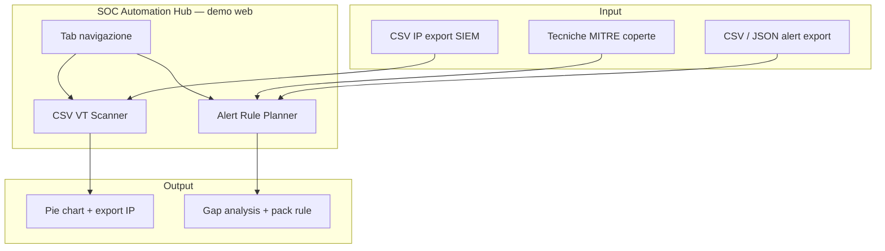

# Architettura tecnica

## Struttura hub

Ogni tool in `tools/` è un progetto autonomo con propri `package.json`, test e README.  
La **demo web** (GitHub Pages) espone più moduli in un'unica SPA React con tab di navigazione.

## csv-vt-scanner — layer

| Layer | Stack | Responsabilità |
|-------|-------|----------------|
| UI | React, Vite | Tab hub, upload, tabelle, grafico SVG, export |
| Logica VT | TypeScript | Parse CSV IP, stats, orchestrazione scan |
| Logica coverage | TypeScript | Parse tecniche MITRE, CSV/JSON alert, gap analysis, template rule |
| Desktop | Tauri 2, Rust | Chiamate VirusTotal, storage locale, dialog file |
| Demo web | GitHub Pages | Classificazione VT simulata + Alert Rule Planner (solo browser) |

## Flusso scan (desktop)

1. L'utente configura le chiavi VT nell'app (storage locale in `data/` accanto all'eseguibile)
2. Il frontend invoca `vt_lookup` via Tauri per ogni IP pubblico
3. Il backend Rust applica throttle per chiave (~15s) e failover su chiavi multiple
4. I risultati vengono aggregati; checkpoint salvato ogni N IP
5. Export tramite dialog nativo o download (web)

## Flusso demo — CSV VT Scanner (web)

1. Parse CSV lato browser
2. `runDemoScan` classifica gli IP con regole deterministiche (nessuna API)
3. Statistiche ed export come nel desktop

## Flusso demo — Alert Rule Planner (web)

1. L'operatore incolla l'inventario tecniche MITRE coperte (`parseTechniquesFromText`)
2. Carica export alert in CSV o JSON (`parseAlertsInput` → stessa tabella normalizzata del parser LogPoint)
3. `analyzeCoverage` mappa segnali osservati → tecniche (`signalMap`), rileva vendor (`vendors`)
4. Per ogni tecnica: stato **gap** / **covered** / **blind**; sui gap genera pack rule (`ruleTemplates`: query, intervallo, throttle, Jinja, `copyBlock`)
5. Preferenze tecniche salvate in `localStorage` del browser (nessun backend)

### Moduli alert coverage

| File | Ruolo |
|------|-------|
| `parseTechniques.ts` | Parsing elenco MITRE, merge con seed |
| `parseAlertsInput.ts` | CSV o JSON (array / wrapper `events`, `records`, …) |
| `parseExport.ts` | Parser CSV export SIEM |
| `signalMap.ts` | Regole segnale → tecnica |
| `analyzeCoverage.ts` | Orchestrazione gap / covered / blind |
| `ruleTemplates.ts` | Pack rule LogPoint-ready (prefisso `AR-`) |
| `allowlist.ts` | Esclusioni rumore nelle query |

## CI/CD

- **pages.yml** — build Vite con `base: /soc-automation-hub/` e deploy su GitHub Pages
- **release.yml** — build Tauri su `windows-latest`, artifact zip portable
