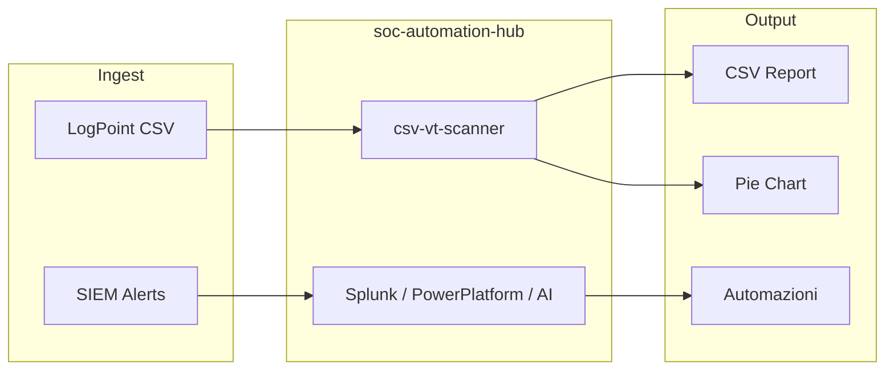

# Architettura SOC Automation Hub

## Visione

Hub modulare di tool per Security Operations: ogni cartella sotto `tools/` è un progetto autonomo con README, test e (se applicabile) demo web + build desktop.

## Modulo 1: csv-vt-scanner

| Layer | Tecnologia | Ruolo |
|-------|------------|-------|
| UI | React + Vite | Upload, tabella, grafico SVG, export |
| Desktop | Tauri 2 + Rust | VT API, multi-key, file system |
| Web demo | GitHub Pages | Classificazione simulata, nessuna API key |

### Flusso dati

1. Parse CSV → dedup IP → skip privati
2. Scan (VT reale o demo) → categoria per IP
3. Statistiche → grafico a torta + percentuali
4. Export → CSV malevoli o completo

## Roadmap

1. **csv-vt-scanner** — pubblicato (questo repo)
2. **splunk-detections** — SPL + sample logs
3. **power-platform-soc** — template Logic Apps / Power Automate
4. **ai-alert-triage** — pipeline LLM per alert JSON

## Sincronizzazione

Sviluppo interno possibile in `logpoint-guardsix`; le versioni pubbliche vengono portate qui in forma sanitizzata.
