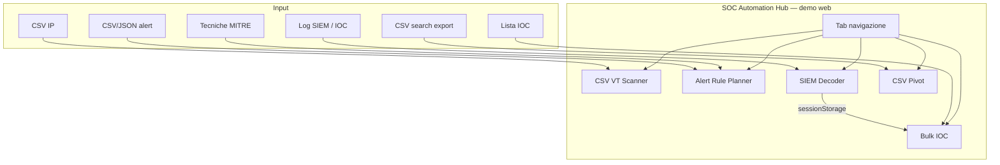

# Architettura tecnica

## Struttura hub

Un package React/Vite in `tools/csv-vt-scanner/` espone **5 moduli demo** via tab in `App.tsx`. L'app desktop Tauri condivide la stessa UI con scan VT/OSINT reali.

## Layer

| Layer | Stack | Responsabilità |
|-------|-------|----------------|
| UI | React, Vite | Tab hub, upload, tabelle, grafici, export |
| VT / IOC | TypeScript | Parse CSV IP, bulk IOC, demoScan / Tauri VT |
| Coverage | TypeScript | MITRE, gap analysis, rule templates |
| Decoder | TypeScript | Multi-vendor parse, hunt pack, case report |
| CSV LP | TypeScript | Parse export, aggregate, pivot queries |
| Desktop | Tauri 2, Rust | VT API, checkpoint, file dialog |

## Flussi demo web

- **CSV VT / Bulk IOC:** classificazione simulata (`demoScan.ts`) — nessuna rete
- **Alert Planner:** parse CSV/JSON alert + MITRE inventory (`localStorage`)
- **SIEM Decoder:** estrazione locale + permalinks OSINT; opzionale bridge → Bulk IOC
- **CSV Pivot:** statistiche e query pivot con allowlist default

## Flusso desktop

Chiavi VT in `data/` accanto all'eseguibile → `vt_lookup` Rust → checkpoint JSON per CSV VT e Bulk IOC.

## Lab SOAR demo (NUC — fuori dalla demo web)

Pipeline documentata in [`docs/lab-n8n/`](lab-n8n/README.md): Windows logs → Splunk Free → n8n schedule (Warning+ via file bridge / winlogs, perché Free blocca REST remoto) → `alerts_triage` open/closed → TI Dispatcher (ip-api / DNS / CIRCL + stub VT/Shodan/MISP) → report HTML + Ollama → webhook close.

Motivo n8n: su Splunk Free non ci sono alert programmate native né REST auth remoto; l’orchestration esterna è il pattern corretto SIEM/SOAR.

## CI/CD

- **pages.yml** — build Vite `base: /soc-automation-hub/` → GitHub Pages
- **release.yml** — Tauri portable Windows

## Test

~70 test Vitest in `tests/lib/` — parser, decoder, coverage, allowlist, bulk IOC.
