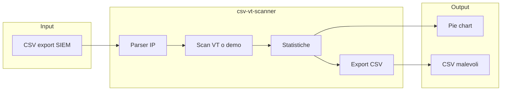

# Architettura tecnica

## Struttura hub

Ogni tool in `tools/` è un progetto autonomo con propri `package.json`, test e README.

## csv-vt-scanner — layer

| Layer | Stack | Responsabilità |
|-------|-------|----------------|
| UI | React, Vite | Upload, tabella, grafico SVG, export |
| Logica | TypeScript | Parse CSV, stats, orchestrazione scan |
| Desktop | Tauri 2, Rust | Chiamate VirusTotal, storage locale, dialog file |
| Demo web | GitHub Pages | Classificazione simulata senza rete |

## Flusso scan (desktop)

1. L'utente configura le chiavi VT nell'app (storage locale in `data/`)
2. Il frontend invoca `vt_lookup` via Tauri per ogni IP pubblico
3. Il backend Rust applica throttle per chiave (~15s) e failover su chiavi multiple
4. I risultati vengono aggregati; checkpoint salvato ogni N IP
5. Export tramite dialog nativo o download (web)

## Flusso demo (web)

1. Parse CSV lato browser
2. `runDemoScan` classifica gli IP con regole deterministiche (nessuna API)
3. Stessa UI di statistiche ed export del desktop

## CI/CD

- **pages.yml** — build Vite con `base: /soc-automation-hub/` e deploy su GitHub Pages
- **release.yml** — build Tauri su `windows-latest`, artifact zip portable
