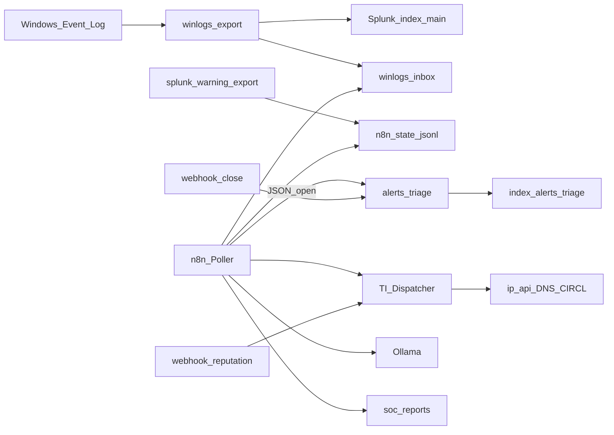

# Lab n8n + Splunk (NUC)

Repository dedicato: [soc-n8n-splunk-lab](https://github.com/DarkGreen-projects/soc-n8n-splunk-lab).

Laboratorio SOC su NUC: Splunk Free come SIEM e n8n come orchestration. Sulla Free non sono disponibili alert schedulate native e il login REST remoto è disabilitato; i workflow compensano con bridge file, triage open/closed ed enrichment IOC. Gli export JSON sanitizzati sono anche in [`workflows/`](workflows/).



## Esecuzione sul lab

```powershell
C:\lab\lab-up.ps1
powershell -File C:\lab\scripts\import-n8n-workflows.ps1
powershell -File C:\lab\scripts\demo-soc-pipeline.ps1
powershell -File C:\lab\scripts\splunk-warning-export.ps1
```

- Reputation: http://localhost:5678/webhook/lab-reputation?ip=8.8.8.8  
- Splunk: http://localhost:8000 (`index=alerts_triage`)  
- Report: `C:\lab\data\soc-reports\`

Enrichment operativo: ip-api, Google DNS, CIRCL. Stub dichiarati: VirusTotal, Shodan, AbuseIPDB, MISP.  
Riferimento di pattern: [inthecyber securityonion-n8n-workflows](https://github.com/inthecyber-group/securityonion-n8n-workflows).
