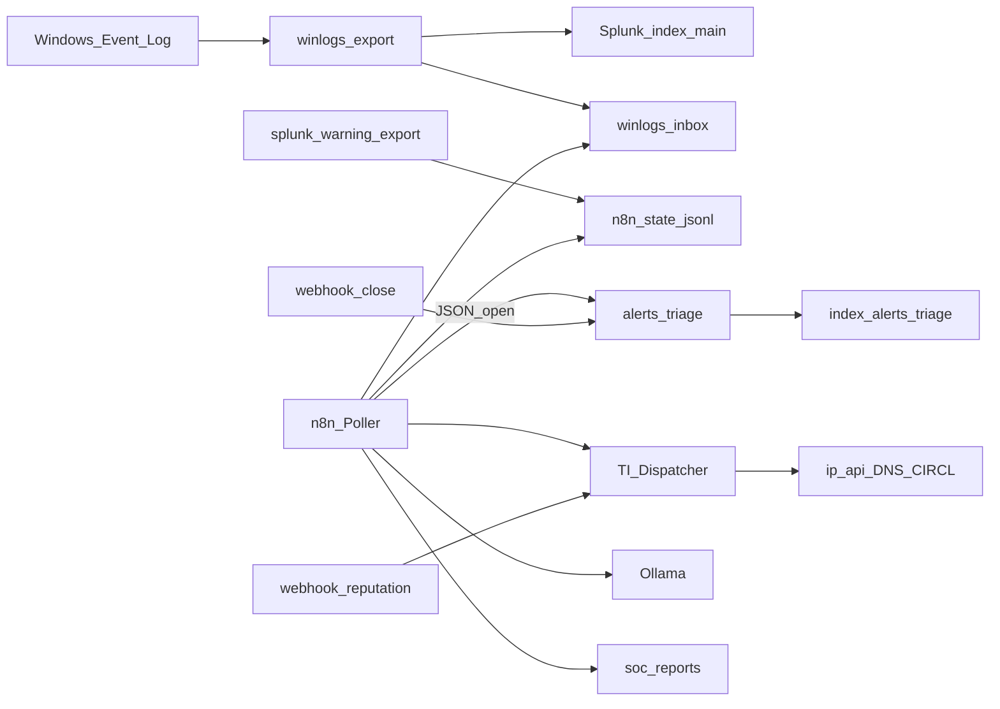

# Lab n8n + Splunk (NUC)

Repo dedicato: [soc-n8n-splunk-lab](https://github.com/DarkGreen-projects/soc-n8n-splunk-lab).

Qui sul NUC uso Splunk Free come SIEM e n8n per detection/triage/enrichment, perché sul Free non hai alert schedulate e il REST remoto non autentica. I workflow JSON sanitizzati stanno anche in [`workflows/`](workflows/).



## Sul lab

```powershell
C:\lab\lab-up.ps1
powershell -File C:\lab\scripts\import-n8n-workflows.ps1
powershell -File C:\lab\scripts\demo-soc-pipeline.ps1
powershell -File C:\lab\scripts\splunk-warning-export.ps1
```

- Reputation: http://localhost:5678/webhook/lab-reputation?ip=8.8.8.8  
- Splunk: http://localhost:8000 (`index=alerts_triage`)  
- Report: `C:\lab\data\soc-reports\`

Enrichment live: ip-api, Google DNS, CIRCL. Stub voluti: VT / Shodan / AbuseIPDB / MISP.  
Pattern Dispatcher ispirato a [inthecyber securityonion-n8n-workflows](https://github.com/inthecyber-group/securityonion-n8n-workflows).
