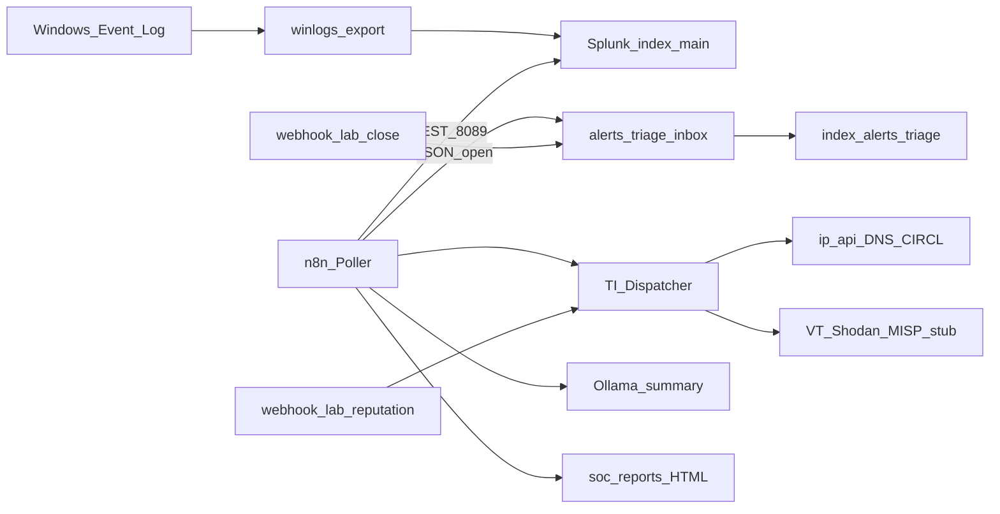

# NUC Lab — SOC n8n + Splunk demo

> **Repo dedicato (portfolio):** [DarkGreen-projects/soc-n8n-splunk-lab](https://github.com/DarkGreen-projects/soc-n8n-splunk-lab) — README vetrina, workflow export e guide IT.

Demo di automazione SOC su lab domestico (ASUS NUC): **Splunk Free** come SIEM, **n8n** come orchestration (al posto delle alert native non disponibili su Free), enrichment IOC stile [Security Onion n8n workflows](https://github.com/inthecyber-group/securityonion-n8n-workflows), **Ollama** per un breve triage AI.

Obiettivo portfolio: mostrare un flusso **reale e raccontabile** (non solo UI mock) collegando ingest log → detection schedule → triage open/closed → reputation report → chiusura.

## Architettura

## Workflow (JSON)

Sanitizzati, senza secret — anche in `C:\lab\exports\n8n-workflows\`:

| File | Ruolo |
|------|--------|
| `LAB-TI-Dispatcher.json` | Webhook `/webhook/lab-reputation?ip\|domain\|hash\|cve=` → HTML |
| `LAB-IP-Reputation.json` | Modulo IP (ip-api + stub TI) |
| `LAB-Domain-Reputation.json` | Modulo domain (Google DNS + stub) |
| `LAB-Hash-Reputation.json` | Modulo hash (validazione + stub VT) |
| `LAB-CVE-Info.json` | Modulo CVE (CIRCL, no key) |
| `LAB-Splunk-Warning-Poller.json` | Schedule 5 min → Splunk Warning+ → triage → enrich → Ollama → report |
| `LAB-Close-Alert.json` | POST `/webhook/lab-close` → `status=closed` |
| `LAB-Manual-Demo-Pipeline.json` | Trigger manuale senza attendere lo schedule |

## Enrichment: free vs stub

| Provider | Modalità demo |
|----------|----------------|
| ip-api.com | Live (geo/ISP), no key |
| Google DNS JSON | Live resolve domain |
| cve.circl.lu | Live CVE lookup |
| VirusTotal / Shodan / AbuseIPDB / MISP | **Stub esplicito** (`provider=stub (no API key)`) — slot pronti per upgrade |

## Come riprodurre sul lab

1. `C:\lab\lab-up.ps1`
2. (Opzionale) `docker exec -it lab_ollama ollama pull llama3.2:1b`
3. `python C:\lab\scripts\generate-n8n-workflows.py` (se serve rigenerare)
4. `powershell -File C:\lab\scripts\import-n8n-workflows.ps1`
5. In n8n UI attiva **LAB - TI Dispatcher**, **LAB - Close Alert**, **LAB - Splunk Warning Poller**
6. `powershell -File C:\lab\scripts\demo-soc-pipeline.ps1`
7. Apri report in `C:\lab\data\soc-reports\` e contatori Splunk su `index=alerts_triage`

### URL utili

- n8n: http://localhost:5678  
- Splunk: http://localhost:8000  
- Reputation: http://localhost:5678/webhook/lab-reputation?ip=8.8.8.8  
- Close: `POST /webhook/lab-close` body `{"alert_id":"...","owner":"demo"}`

## Perché n8n (non Splunk Alert UI)

Su **Splunk Free** le alert programmate native non sono disponibili. Inoltre Free **disabilita il login REST remoto** (`Remote login disabled ... free license`). Per questo il poller n8n:

1. legge `warning-plus.jsonl` prodotto sul host da `splunk-warning-export.ps1` (`docker exec` + `splunk search`), oppure  
2. fa fallback sui JSON in `winlogs-inbox` (stessi file che Splunk indexa)

Poi scrive triage in `alerts_triage` (visibile in Splunk) + report HTML + summary Ollama. Orchestration esterna = pattern corretto SIEM/SOAR sul Free.

## Screenshot checklist (per README / LinkedIn)

1. Report HTML IP Reputation (geo reale + stub TI)  
2. File JSON open/closed in triage inbox  
3. Esecuzione n8n Poller / Manual Demo  
4. Search Splunk `index=alerts_triage`  
5. (Opzionale) bullet AI da Ollama nel report  

## Licenza / attribution

Pattern Dispatcher ispirato a InTheCyber Group Security Onion n8n workflows (MIT-style public repo). Adattamento lab Splunk Free + stub TI + Ollama: DarkGreen Projects / SOC Automation Hub.
